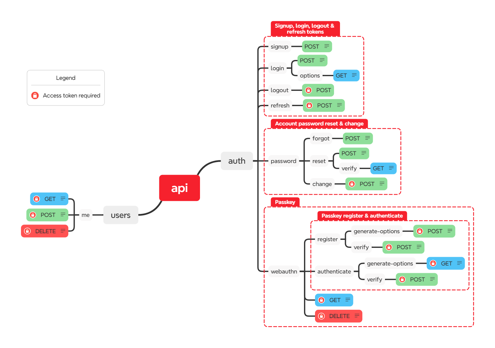

[](https://www.python.org)

# FastAPI Passkey Authentication (*STILL IN DEVELOPMENT)

This project demonstrates a FastAPI application with login functionality using passkey authentication.

## Features

- **Package Management & Environment**:
  - Uses Poetry for package management
  - Environment variables set up in `.env` file
  - Async implementation throughout the application

- **Database**:
  - Uses SQLAlchemy for database access with SQLite for demo purposes
  - Database migrations handled by Alembic
  - Creates database tables on startup if they do not exist
  - Migrates database to the latest version on startup

- **Authentication**:
  - Users can login using either:
    - Email & password
    - Passkey (WebAuthn)

## Endpoints
WebAuthn
- [x] `POST /auth/webauthn/register/generate-options`: Initiates the registration flow
- [ ] `POST /auth/webauthn/register/verify`: Verifies and completes new passkey registration
- [ ] `GET /auth/webauthn/authenticate/generate-options`: Initiates the authentication flow
- [ ] `POST /auth/webauthn/authenticate/verify`: Verifies and completes authentication with existing passkey

Auth
- [x] `POST /auth/register`, Register new user
- [x] `POST /auth/login`, Login using email & password
- [ ] `POST /auth/logout`, Logout
- [ ] `POST /auth/jwt/refresh`, Refresh tokens

Password
- [ ] `POST /auth/password/forgot`, Request reset password
- [ ] `POST /auth/password/reset`, Reset password using token
- [ ] `GET /auth/password/reset/verify`, Verify if reset token still valid
- [ ] `POST /auth/password/change`, Change password

Users
- [x] `GET /users/me`, Get current user information
- [x] `POST /users/me`, Update current user information
- [ ] `DELETE /users/me`, Delete current user
- [ ] `GET /users/{user_id}`, Get a user information
- [ ] `POST /users/{user_id}`, Update a user information
- [ ] `DELETE /users/{user_id}`, Delete a user

Root
- [x] `GET /health`, Health check



## Installation

1. Clone the repository:
    ```sh
    git clone https://github.com/dennislwy/fastapi-passkey-auth.git
    cd fastapi-passkey-auth
    ```

2. Install dependencies using Poetry:
    ```sh
    poetry install
    ```

3. Set up environment variables:
    - Copy `.env.example` to `.env` and update the values as needed.

4. Run database migrations:
    ```sh
    alembic upgrade head
    ```

## Running the Application

1. Start the FastAPI application:
```sh
poetry run uvicorn app.main:app --reload
```

2. Navigate to link below - http://localhost:8000

## Adding a Migration

To add a new database migration, follow these steps:

1. Make changes to your SQLAlchemy models in the `models` directory.

2. Generate a new migration script:
    ```sh
    alembic revision --autogenerate -m "Description of the migration"
    ```

3. Apply the migration:
    ```sh
    alembic upgrade head
    ```

## License
This project is licensed under the MIT License. See the [LICENSE](LICENSE) file for details.
